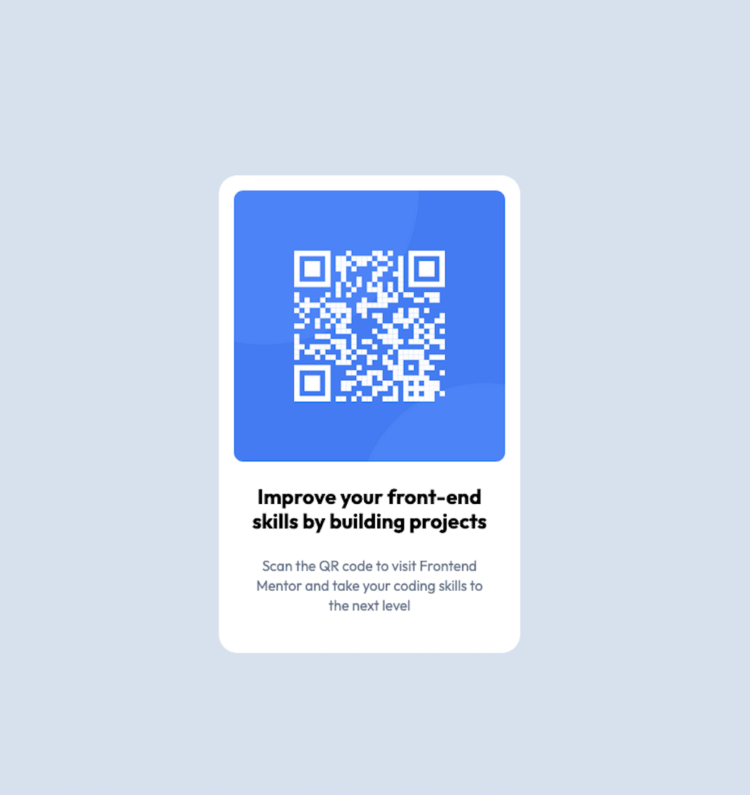

# Frontend Mentor - QR code component solution

This is a solution to the [QR code component challenge on Frontend Mentor](https://www.frontendmentor.io/challenges/qr-code-component-iux_sIO_H). Frontend Mentor challenges help you improve your coding skills by building realistic projects. 

## Table of contents

- [Overview](#overview)
  - [Screenshot](#screenshot)
- [My process](#my-process)
  - [Built with](#built-with)
  - [What I learned](#what-i-learned)
  - [AI Collaboration](#ai-collaboration)

**Note: Delete this note and update the table of contents based on what sections you keep.**

## Overview

### Screenshot

### SOLUTION

- Live solution: [QR code challenge solution](https://geo86.github.io/FM---challenge-1---QR-code-challenge/)

## My process

### Built with

- Semantic HTML5 markup
- CSS custom properties
- SaaS
- Flexbox
- CSS Grid
- Mobile-first workflow

### What I learned

I learnt how to use Github to host web pages and start to get acquainted to Git.

